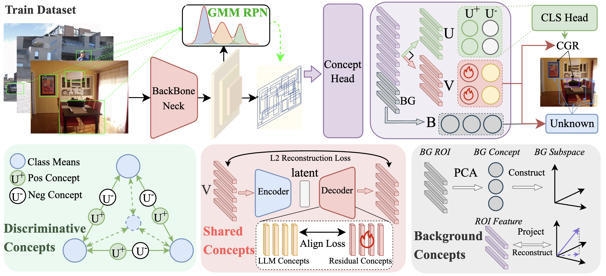

## IPOW: Interpretable Open-World Object Detection via Concept Decomposition



### ✨ Contributions

- We propose a concept-driven OWOD framework that decomposes RoI features into discriminative, shared, and background concepts for known and unknown detection.
- We identify that known–unknown confusion arises from unknown objects falling into the discriminative space and propose Concept-Guided Rectification (CGR) to address it.
- Extensive experiments demonstrate state-of-the-art performance on known classes, superior unknown recall, and concept-level interpretability.

### Data Preparation

The data structure of `data/OWOD` is like

```
├── OWOD/
│   ├── JPEGImages/
│   │   ├── SOWODB/
│   │   └── MOWODB/
│   ├── Annotations/
│   │   ├── SOWODB/
│   │   └── MOWODB/
└── └── ImageSets/
        ├── SOWODB/
        └── MOWODB/
```

For detailed dataset construction, please refer to [YOLO-UniOW/docs/data](https://github.com/THU-MIG/YOLO-UniOW/blob/main/docs/data.md).

### Installation

This repo is based on [MMDetection 3.3](https://github.com/open-mmlab/mmdetection) Please follow the installation of MMDetection [GETTING_STARTED.md](https://mmdetection.readthedocs.io/en/latest/get_started.html) and make sure you can run it successfully.

### Training & Evaluation

```bash
# Train Model On OWOD
PORT=29501 DATASET=MOWODB TASK=1 bash ./tools/dist_train.sh configs/itow/itow_owod_mowodb_t1.py 4 --amp
PORT=29501 DATASET=MOWODB TASK=2 bash ./tools/dist_train.sh configs/itow/itow_owod_mowodb_t2.py 4 --amp
PORT=29501 DATASET=MOWODB TASK=3 bash ./tools/dist_train.sh configs/itow/itow_owod_mowodb_t3.py 4 --amp
PORT=29501 DATASET=MOWODB TASK=4 bash ./tools/dist_train.sh configs/itow/itow_owod_mowodb_t4.py 4 --amp
```

### Acknowledgement

Our code is based on the project [MMDetection](https://github.com/open-mmlab/mmdetection). We sincerely thank the authors for their excellent implementations!